## Jenkins Master 설치

### 1. Main EC2 접속

- 여유있다면 Termius로 접속하는 방법까지?

### 2. Docker 설치

1. package 업데이트

```
sudo apt-get update
```

1. Docker 설치

```
curl -fsSL https://get.docker.com -o get-docker.sh
sudo sh get-docker.sh
```

1. docker 그룹에 현재 사용자 추가

```
sudo usermod -aG docker [username]
```

1. **서버 재접속**

- 재접속 안하고 docker 명령어를 사용했을 때 생기는 오류 캡쳐해서 넣기

### 3. Jenkins Master 설치 및 설정

1. Docker Hub에서 jenkins 이미지 pull

```
$ docker pull jenkins/jenkins:lts-jdk11
```

1. 위 이미지로 Container 구동

```
$ docker run -d -v jenkins_home:/var/jenkins_home -p 8080:8080 -p 50000:50000 --restart=on-failure --name jenkins-server jenkins/jenkins:lts-jdk11
```

- docker ps로 Container 구동 확인

1. 로그 접근 후 초기 비밀번호 복사

   ```jsx
   docker logs jenkins-server
   ```

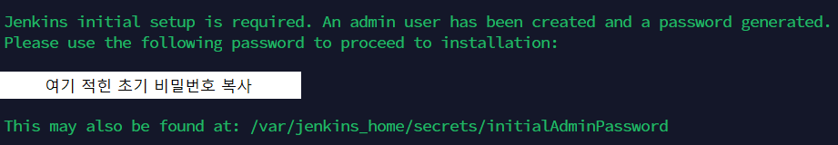

2. `[메인 EC2 도메인 or IP]:8080/` 에 접속하여 초기 비밀번호 붙여넣기

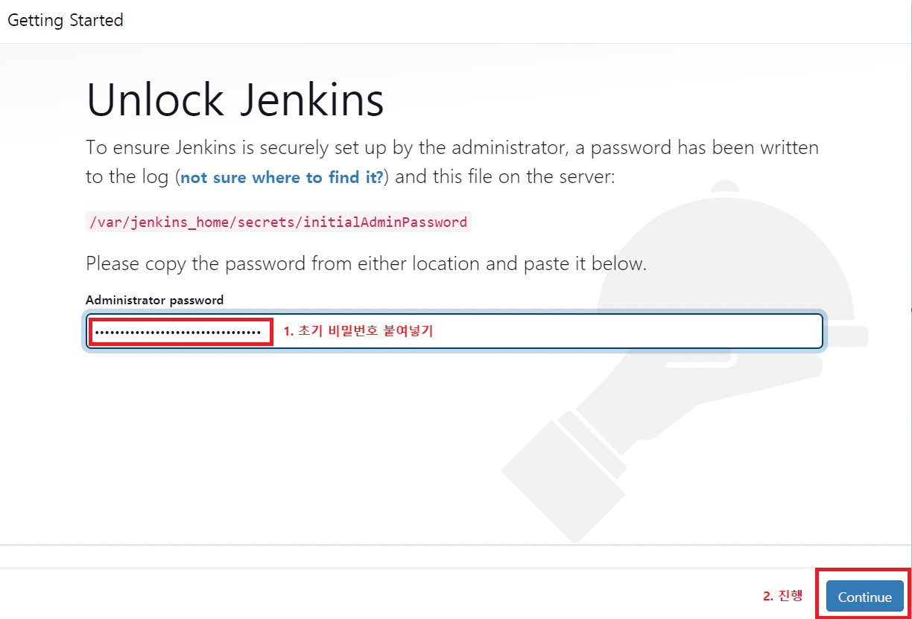

3. install 버튼 클릭

   - 나중에 캡쳐 사진 가져오기

4. 계정 생성

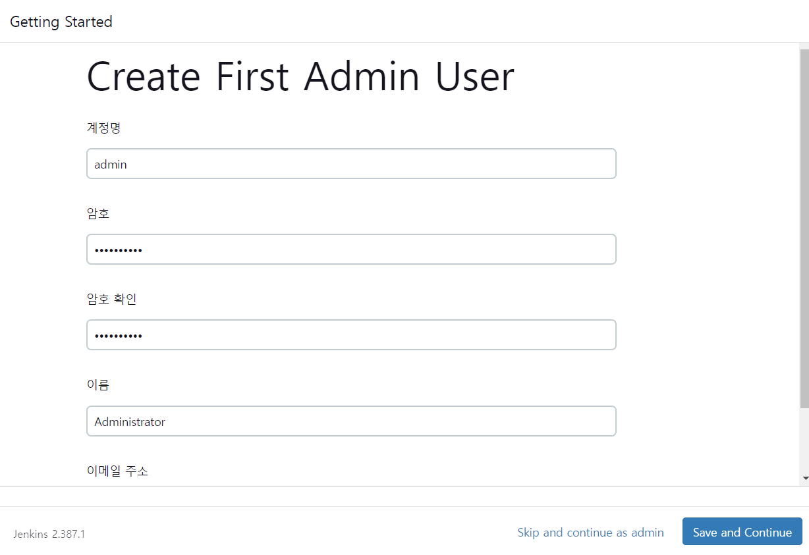

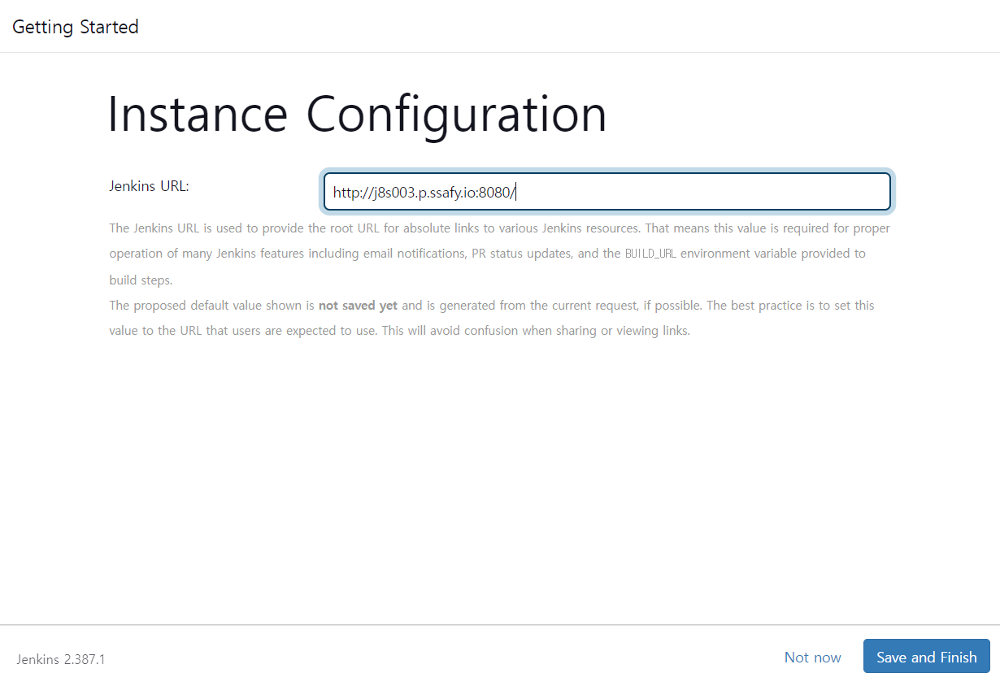

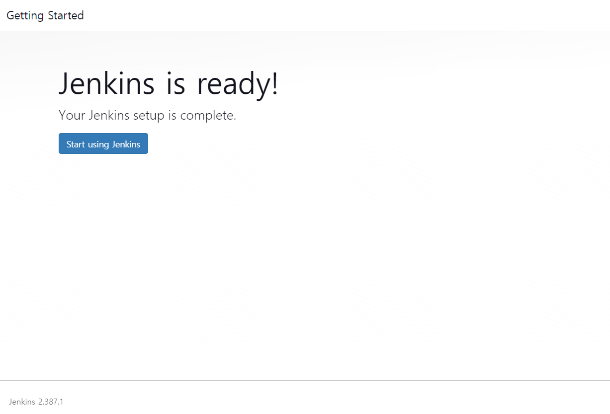

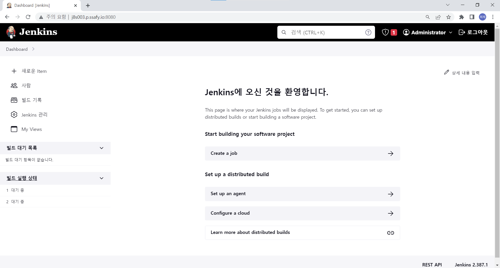

## Ansible Server 설치

### 1. Docker Container 생성

```jsx
docker run --privileged -itd --name ansible-server -p 20022:22 -p 8081:8080 -e container=docker -v /sys/fs/cgroup:/sys/fs/cgroup ubuntu:20.04 /bin/bash
```

### 2. Ansible-Server 접속

```jsx
docker exec -it ansible-server bash
```

### 3. Ansible 설치

```
apt update
apt install software-properties-common
```

- 도시 설정

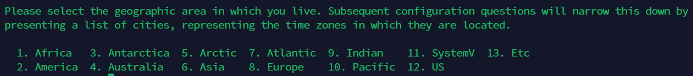


```jsx
add-apt-repository --yes --update ppa:ansible/ansible
apt install ansible
```


## Host 파일 생성

### 1. vim 설치

```jsx
apt-get install vim
```


### 2. Inventory 작성

1. `sudo vi /etc/ansible/hosts`
2. 다음과 같이 수정

```
[k8s-workers]
(빌드 서버1 IP)
(빌드 서버2 IP)
(빌드 서버3 IP)

[k8s-master]
(k8s 서버 IP)
```

## SSH 연결

### 1. K8s Master, Build Server에 Password 생성(자동화 생각해보기)

- K8s Master Server에 접속
- /etc/ssh/sshd_config 파일 수정(PasswordAuthentication yes)

```jsx
sudo vi /etc/ssh/sshd_config
```

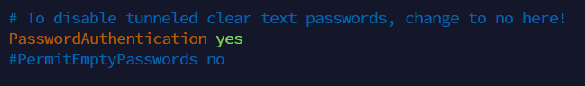

- root 계정 접속

```jsx
sudo su
```

- `ubuntu` 사용자의 비밀번호 변경

```jsx
passwd ubuntu
```

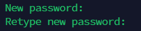

- `ubuntu` 사용자로 돌아와 ssh 재시작

```
# return to user "ubuntu"
exit

# restart ssh
sudo systemctl restart ssh
```

- 모든 빌드 서버에 대하여 위 과정 실행

### 2. SSH key 생성 (자동화 생각해보기)

- ansible-server에서 `ssh-keygen` 입력
- Enter 3번 입력

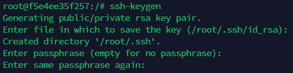

### 3. K8s Master, Build Server에 SSH key 복사

- ansible-server에서 다음과 같이 입력(SSH key를 해당 서버에 복사)

```
# copy the SSH key to the server
ssh-copy-id -i ~/.ssh/id_rsa.pub ubuntu@[k8s master 또는 빌드 서버 IP]
```

- yes 입력 후 해당 빌드 서버에 저장해둔 비밀번호 입력

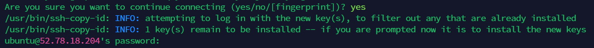


- 나머지 서버에도 위 과정 반복

## Docker 설치

### 1. Playbook, Shell script를 저장할 폴더 생성

```
mkdir /home/ansible-playbook
mkdir /home/init-scripts
```

### 2. Docker 설치를 위한 Shell script 파일 생성

```
vi /home/init-scripts/install-docker.sh
```

- 아래 내용 입력 및 저장

```
# remove docker if exists
sudo apt-get remove docker docker-engine docker.io containerd runc

# update apt packages
sudo apt-get update
sudo apt-get -y install \
    ca-certificates \
    curl \
    gnupg \
    lsb-release

# add docker's GPG key
sudo rm -r /etc/apt/keyrings
sudo mkdir -m 0755 -p /etc/apt/keyrings
curl -fsSL https://download.docker.com/linux/ubuntu/gpg | sudo gpg --dearmor -o /usr/share/keyrings/docker-archive-keyring.gpg

echo \
    "deb [arch=$(dpkg --print-architecture) signed-by=/usr/share/keyrings/docker-archive-keyring.gpg] https://download.docker.com/linux/ubuntu \
     $(lsb_release -cs) stable" | sudo tee /etc/apt/sources.list.d/docker.list > /dev/null

# install docker engine
sudo apt-get update
sudo apt-get install -y docker-ce docker-ce-cli containerd.io docker-buildx-plugin docker-compose-plugin

# add docker group
sudo usermod -aG docker $USER

# resetting the permissions
sudo chown -R $USER:$USER /var/run/docker.sock
sudo chmod -R 660 /var/run/docker.sock
```

### 3. Docker 설치를 위한 Ansible-Playbook 파일 생성

```
vi /home/ansible-playbooks/playbook-install-docker.yml
```

- 아래 내용 입력 및 저장

```
- name: Install Docker
  hosts: all
  remote_user: ubuntu
  tasks:
    - name: Copy Docker install shell script
      copy:
        src=/home/init-scripts/install-docker.sh
        dest=/home/ubuntu/scripts/
        mode=0777

    - name: Execute script
      command: sh /home/ubuntu/scripts/install-docker.sh
      async: 3600
      poll: 5
```

### 4. Docker 설치를 위한 Ansible Playbook 실행

```
ansible-playbook /home/ansible-playbooks/playbook-install-docker.yml# resetting the permissions
```
